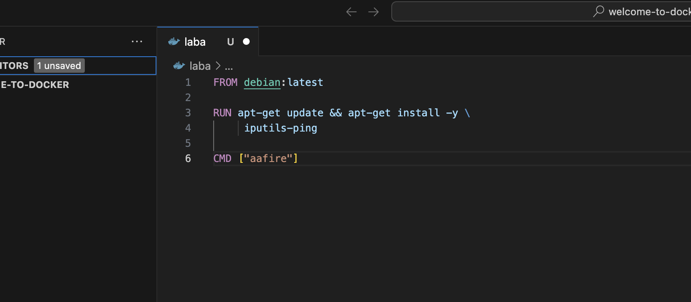
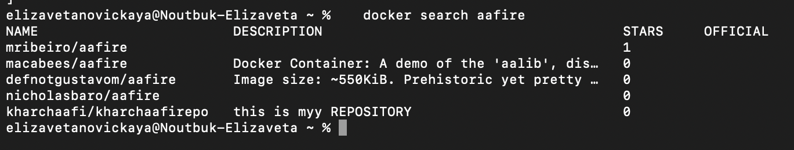
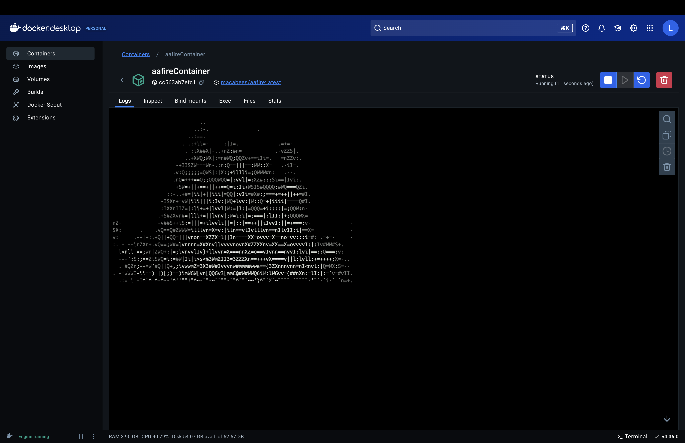
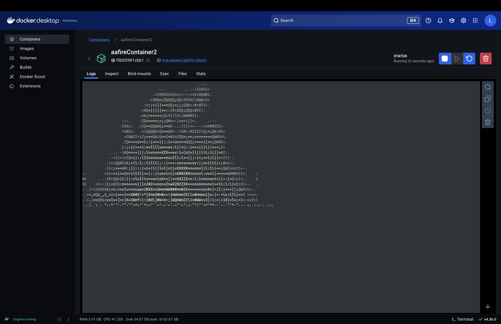
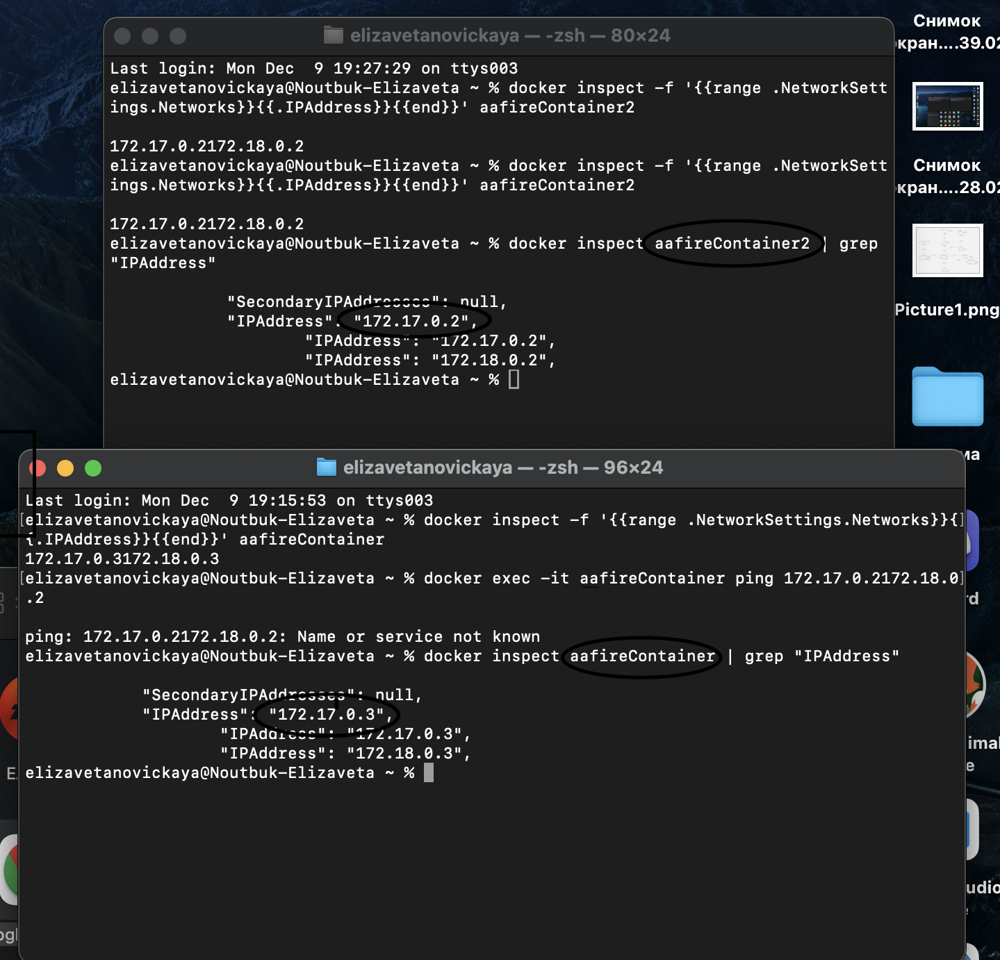
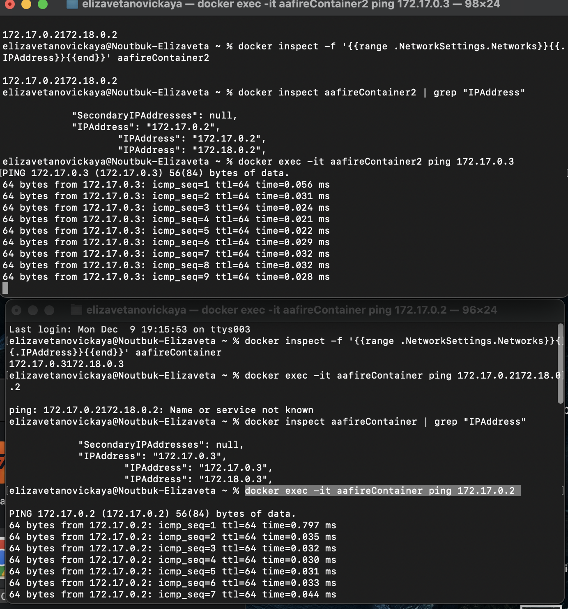

# Новицкая Елизавета К3162 4 Лабораторная работа
1) Я установила docker.desktop c официального сайта

2) Изучила создание собственного образа докера, сделала его, используя VSCode и скаченное расширение докер.декстоп:





  Строка FROM debian: latest указывает то, на основе чего будет построен образ. В моем случае последняя версия официального образа операционной системы Debian из репозитория Docker Hub.

  Однако в процесе работы я столкнулась с тем, что докеры не запускаются с таким образом, поэтому я решила найти альтернативный способ и используя команду - 

```docker search aafire```

   я вывела список доступных образов, связанных с aafire. 




3) Попробовав некоторые образы, я решила использовать один из них.

4) Я ввела  ```docker run -d --name aafireContainer mavroprov/aafire``` , а так же для aafireContainer2 

5) Процесс работы контейнеров:
   





6) Утилита ping уже была установлена в моем терминале

7) Далее по указаниям из задания я ввела все команды:
```docker network create myNetwork```

```docker network connect myNetwork aafireContainer```

```docker network connect myNetwork aafireContainer2```

```docker network inspect myNetwork```

8) Затем выяснила айпи-адреса контейнеров 

```docker inspect aafireContainer | grep "IPAddress"```

```docker inspect aafireContainer2 | grep "IPAddress"```




9) Я разделила терминал на два окна, проверила связь с помощью входа в каждый контейнер и ввода айпи другого через ping

```docker exec -it afireContainer2 ping 172.17.0.3```

```docker exec -it afireContainer1 ping 172.17.0.2```



10) Контейнеры находятся в одной сети
